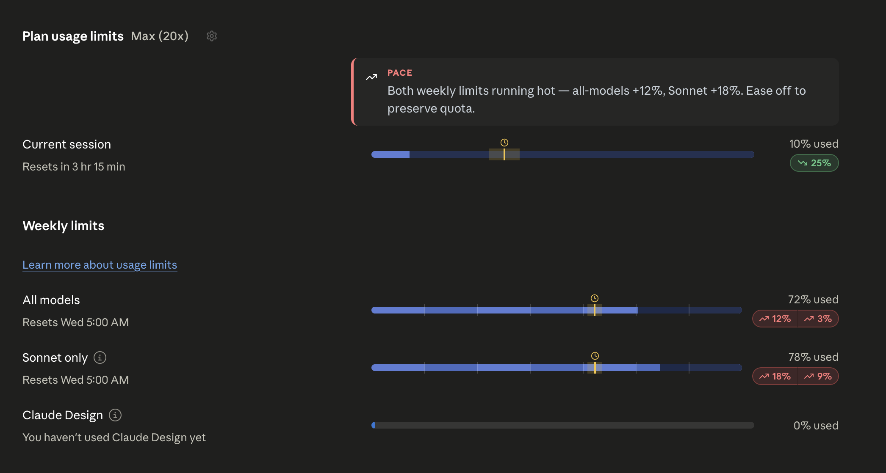
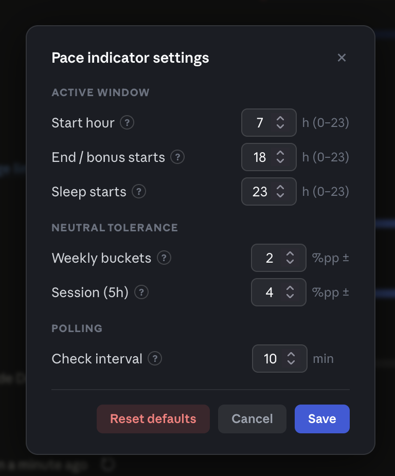

# Claude.ai Usage Pace Indicator

A Tampermonkey userscript that overlays pace indicators on top of [claude.ai/settings/usage](https://claude.ai/settings/usage) — showing whether your token usage is ahead or behind the expected rate for the current time window.

For each usage bar (current 5-hour session, weekly all-models, weekly Sonnet, weekly Opus) it adds:

- a **"now" marker band** showing where consumption *should* be at this moment
- an **over/under-pace pill** with the delta in percentage-points
- a **situation summary card** suggesting what to do next ("ease off Sonnet", "front-load heavy work before the reset", etc.)

> [!WARNING]
> **Heads up — this is a personal tool, vibe-coded for my own use.** It's provided **as-is**, with no warranty of any kind. Expect bugs, rough edges, and breakage when Anthropic changes the usage page. I'm not committing to support, but I'm happy to hear about bugs or improvement ideas via [Issues](https://github.com/rad-orlowski/claude-pace-tracker/issues), and PRs are welcome.

## Screenshots

The overlay on the usage page — situation card on top right, "now" marker bands within each bar, and over/under-pace pills:



The settings panel (gear icon next to the page heading):



## Install

1. Install [Tampermonkey](https://www.tampermonkey.net/) (or Violentmonkey / Greasemonkey) in your browser.
2. Click this link to install: **[claude-usage-pace.user.js](https://github.com/rad-orlowski/claude-pace-tracker/raw/main/dist/claude-usage-pace.user.js)**
3. Tampermonkey opens an install screen — confirm.
4. Open <https://claude.ai/settings/usage>. The pace overlay appears alongside the existing usage bars.

Tampermonkey will auto-update from this repo when new versions ship (via `@updateURL` in the script header).

If you'd rather use the minified build: [claude-usage-pace.min.user.js](https://github.com/rad-orlowski/claude-pace-tracker/raw/main/dist/claude-usage-pace.min.user.js).

## Configuration

A gear icon appears on the usage page. Click it to adjust:

| Setting | Default | What it does |
|---|---|---|
| **Start hour** | `7` | When your "active" period begins. Pace expects quota to be consumed within this window. |
| **End / bonus starts** | `20` | When the active period ends. After this, you're in the "bonus" window. |
| **Sleep starts** | `23` | After this hour, the marker freezes and the script stops nudging you. |
| **Weekly buckets** tolerance | ±2 pp | Tolerance before a weekly bar is marked over/under pace. |
| **Session (5h)** tolerance | ±5 pp | Same, for the current 5-hour session. |
| **Check interval** | `10` min | How often to refetch usage data. |

Settings persist in `localStorage`.

## How it works

The script:

1. **Patches `window.fetch`** at `document-start` to intercept responses from `/api/organizations/{orgId}/usage`.
2. Once the org ID is known, **polls that same endpoint** at the configured interval (default 10 min).
3. Renders the marker band, pace pill, and situation card by injecting DOM into the existing usage page.
4. Re-injects on SPA navigation (the usage page is part of the React app), tearing down cleanly when you leave.

**The pace math:** the weekly quota is treated as something that should be consumed evenly across *active hours only* (default 07:00–20:00, configurable). At any moment, `expected_pct = (active hours elapsed today + full active days passed this week) / total active hours in a week × 100`. The pace delta is `actual_utilization - expected_pct`. So at 13:00 on Wednesday, with default settings, you should be ~46% through your weekly quota; if you're at 60%, the pill shows `+14pp`.

The session bucket uses wall-clock elapsed time within the 5-hour window, not active-hours.

## Privacy

- **No telemetry, no third-party calls.** The script only reads the usage data that the Claude.ai page itself already requests.
- All data stays in your browser.
- The only persistent storage is your settings, in `localStorage` under the key `__claude_pace_cfg`.

## Caveats

- Anthropic can change the usage page DOM at any time; the script locates rows by their heading text (`Current session`, `All models`, `Sonnet only`, `Opus only`). If those strings change, the overlay won't appear and you'll see a console warning.
- The script assumes a single timezone (your browser's local time) for the active-hours calculation. If you cross timezones in a single billing week, the numbers will be slightly off.
- "Active hours" is a heuristic for solo workday usage. If you use Claude in long evening sessions, lower `Sleep starts at` or widen your active window.

## Development

```bash
bun install
bun run build         # → dist/claude-usage-pace.user.js + .min.user.js
bun test              # run all tests
bun test tests/math.test.mjs   # single test file
```

The bundle is built by `build.ts`: Bun bundles `src/main.js` as an IIFE, prepends the userscript header from `meta.txt`, and writes both readable and minified outputs to `dist/`.

## Bugs & contributions

Open an [issue](https://github.com/rad-orlowski/claude-pace-tracker/issues) with:

- What you expected to see
- What you actually saw (a screenshot helps)
- Browser + Tampermonkey version
- Anything in the browser console prefixed with `[claude-pace]`

PRs welcome. No formal contribution process — keep changes focused, run `bun test` before opening.

## License

[GPL-3.0-or-later](./LICENSE). You can use, modify, and redistribute (including commercially), but any derivative work must remain under GPL-3.0.
